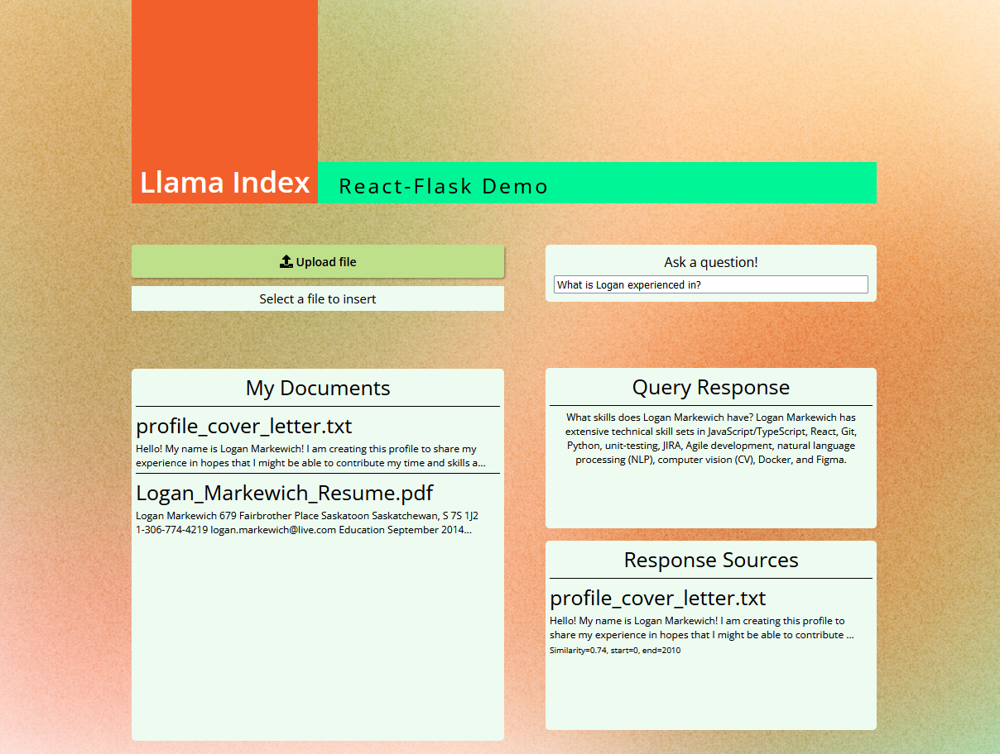

# llama_index_starter_pack
This repository provides very basic flask, [Streamlit](https://llama-index.streamlit.app/), and docker examples for the [llama_index](https://github.com/jerryjliu/gpt_index) (FKA gpt_index) package.

If you need to quickly create a POC to impress your boss, start here!

If you are having trouble with dependencies, I dump my entire env into `requirements_full.txt`, but otherwise, use the base `requirements.txt`.

The basic demo includes the classic "Paul Graham Essay" from the original llama_index repo. Some good starting questions are
- What did the author do growing up?
- Tell me more about interleaf


## Local Setup
```
conda create --name llama_index python=3.11
pip install -r requirements.txt
```


## What is included?
There are two main example folders
- flask_react (runs three services on localhost:5601/5602/3000)
  - `sh launch_app.sh `
  - creates a simple api that loads the text from the documents folder (if any), also launches the react frontend
  - the "/query" endpoint accepts requests that contain a "text" parameter, which is used to query the index
  - the "/upload" endpoint is a POST endpoint that inserts an attached text file into the index
  - the index is managed by a seperate server using locks, since inserting a document is a mutable operation and flask is multithreaded
  - I strongly recommend using a tool like [Postman](https://www.postman.com/downloads/) to test the api - there are example screenshots using postman in the `postman_examples` folder
  - react_frontend
    - A basic frontend using react, which calls the flask_api to insert, view, and query a GPTSimpleVectorIndex
    - The scope for a frontend is basically limitless - this is intended to give a small taste of what's possible for users less familiar with python





- streamlit_vector (runs on localhost:8501)
  - `streamlit run streamlit_demo.py`
  - creates a simple UI using streamlit and GPTSimpleVectorIndex
  - loads text from the documents folder (using `st.cache_resource`, so it only loads once)
  - provides an input text-box and a button to run the query
  - the string response is displayed after it finishes
  - want to see this example in action? Check it out [here](https://huggingface.co/spaces/llamaindex/llama_index_vector_demo)

- streamlit_sql_sandbox (runs on localhost:8501)
  - `streamlit run streamlit_demo.py`
  - creates a streamlit app using a local SQL database about restaurant inspections in San Francisco ([data sample](https://docs.google.com/spreadsheets/d/1Ag5DBIviYiuRrt2yr3nXmbPFV-FOg5fDH5SM3ZEDnpw/edit#gid=780513932))
  - The "Setup" tab allows you to configure various LLM and LLama Index settings
  - The "Llama Index" tab demos some basic Text2SQL capabilities using only Llama Index
  - The "Langchain+Llama Index" tab uses a custom langchain agent, and uses the SQL index from Llama Index as a tool during conversations.
  - Check out the huggingface space [here!](https://huggingface.co/spaces/llamaindex/llama_index_sql_sandbox)

- streamlit_term_definition (runs on localhost:8501)
  - `streamlit run streamlit_demo.py`
  - creates a small app that allows users to extract terms/definitions from documents and query against the extracted information
  - pre-loaded with information from the NYC Wikipedia page
  - supports reading text from image uploads
  - allows users to configure LLM settings
  - users can build their own knowledge base of terms/definitions
  - query against these terms as they are added

## Docker
Each example contains a `Dockerfile`. You can run `docker build -t my_tag_name .` to build a python3.11-slim docker image inside your desired folder. It ends up being about 600MB-900MB depending on the example.

Inside the `Dockerfile`, certain ports are exposed based on which ports the examples need.

When running the image, be sure to include the -p option to access the proper ports (8501, 5601, or 3000).


## Contributing

I welcome any suggestions or PRs, or more examples!
